# Django_RecreationCenter

   &#9000; Это вымышленный проект Базы Отдыха, создан в целях демонстрации моего владения техническим стеком &#128421;
   Сайт предназначен для ознакомления и бронирования услуг в сфере культурного досуга 7 века, в стиле эпохи Викингов.   

   Важно ! Сайт находиться на стадии разработки 
   host: https://djangodiploma.pythonanywhere.com/  
   telebot для заявок с сайта: https://t.me/Recreation_Center_bot вступить в группу заявки с сайта 

<h3 align="center" style="color: green;">The stack used:</h3>

   <b>
Python 3.10;
</b>
   <b>
Django 5.0.2;
</b>
   <b>
JavaScript;
</b>
   <b>
Html;
</b>
   <b>
Css;

   <b>
Pillow;
</b>
   <b>
SqLite3;
</b>
   <b>
YandexMap;
</b>
   <b>
Card Effect;
</b>
   <b>
Swiper-slider;
</b>
   <b>
Simple-captcha
</b>

## Functionality
   <h4>Done:</h4>
   :white_check_mark: Регистрация  
   :white_check_mark: Авторизация  
   :white_check_mark: Разлогинивание (<b>Необходимо войти в ЛК</b>) 
   :white_check_mark: Редактирование пользователя (<b>Необходимо войти в ЛК</b>) 
   :white_check_mark: Добавление изображения пользователя (<b>Необходимо войти в ЛК</b>) 
   :white_check_mark: Модели домов 
   :white_check_mark: Модели тегов 
   :white_check_mark: Модель для слайдера 
   :white_check_mark: Страница профиля (<b>Необходимо войти в ЛК</b>) 
   :white_check_mark: Комментарии к сайту (<b>Необходимо войти в ЛК</b>) 
   :white_check_mark: Добавление домов через админ панель (<b>Необходимо войти в Админ-панель</b>) 
   :white_check_mark: Добавление меню через админ панель (<b>Необходимо войти в Админ-панель</b>) 
   :white_check_mark: Добавление развлечений через админ панель (<b>Необходимо войти в Админ-панель</b>) 
   :white_check_mark: Добавление контента в слайдер через админ панель (<b>Необходимо войти в Админ-панель</b>) 
   :white_check_mark: Динамический Поиск Товаров и Услуг 
   :white_check_mark: Динамические страницы Товаров и Услуг 
   :white_check_mark: Динамическая Пагинация 
   :white_check_mark: Месторасположение на ЯКарте 
   :white_check_mark: Админ панель и модели на Русском языке 
   :white_check_mark: Телебот 

   

   <h4>Works:</h4>

   :black_square_button: Мобильное меню 
   :black_square_button: Адаптация сайта до 350px 
   :black_square_button: Корзина и бронирование 

   <h4>Not ready:</h4>
   :negative_squared_cross_mark: Доступ персонала 
   :negative_squared_cross_mark: Бронирование домов 
   :negative_squared_cross_mark: Открытие новых возможностей по прибытию пользователя 
   

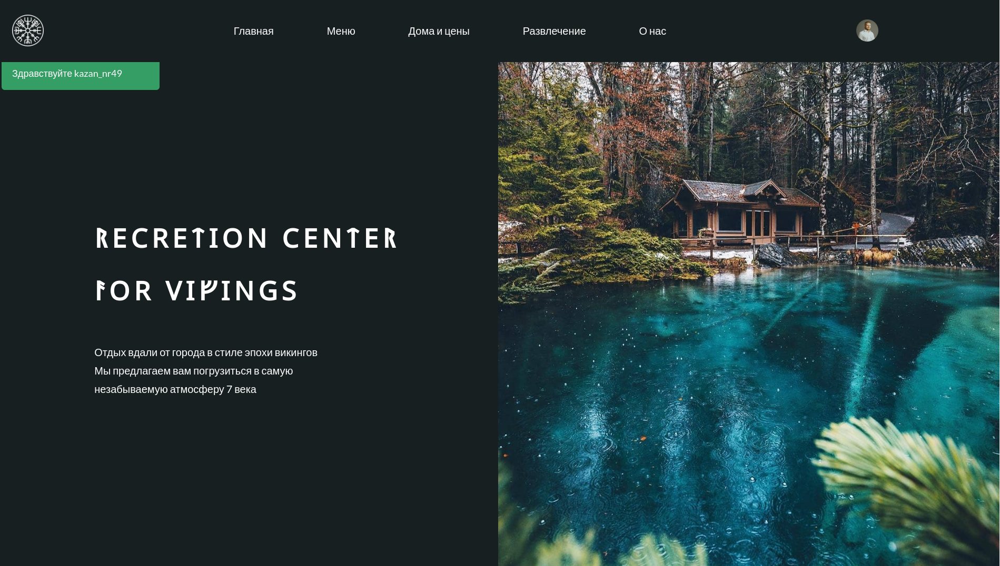

   В приложении присутствует меню навигации и регистрация, авторизация, 
   настройка личного кабинета, бронирование услуг и панель администратора.   
   1.Навигация 
   В каждом разделе есть категория услуг предоставленным сайтом. Пользователь может ознакомиться более
   подробной с той или иной услугой, кликнув на конкретную карточку. 

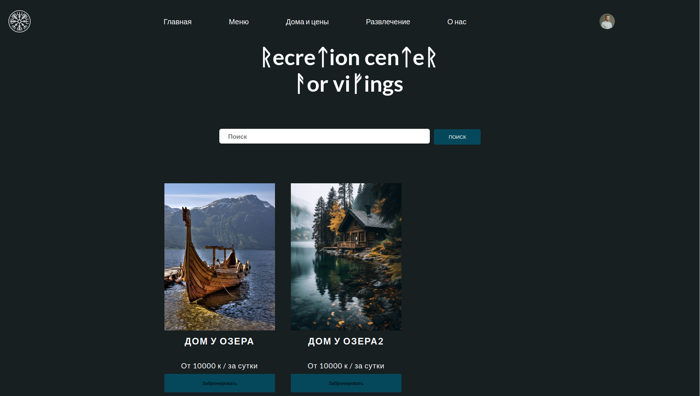
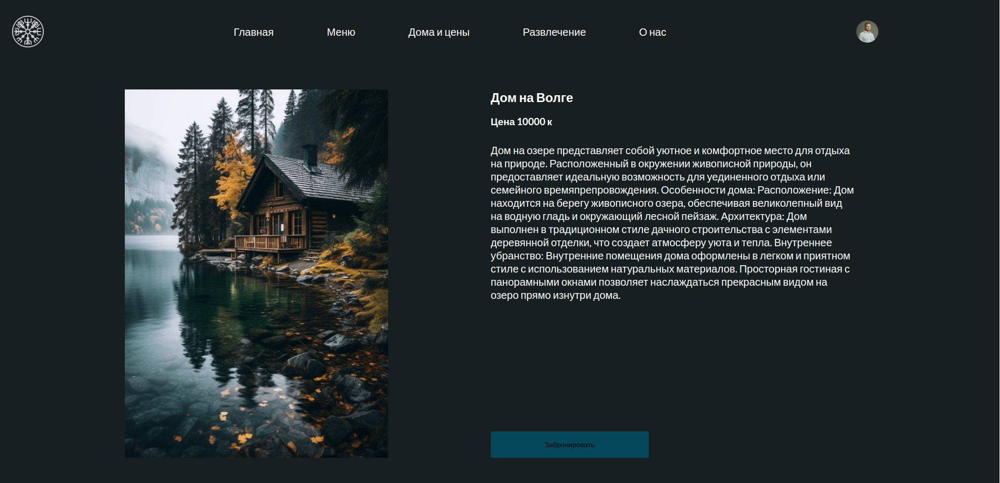
  

   На сайте есть возможность поиска по цене и названию, а так же присутствует пагинация 

   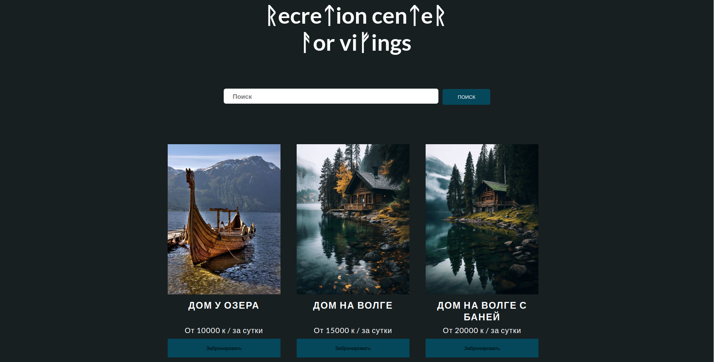
   
   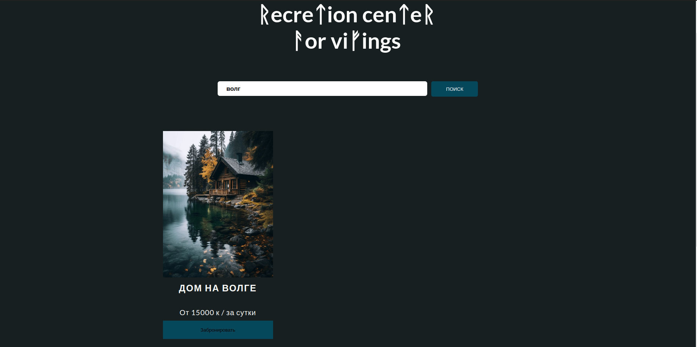
  

В нижней части сайта расположен подвал с дублирующимися элементами шапки приложения, адрес и контактная информация.

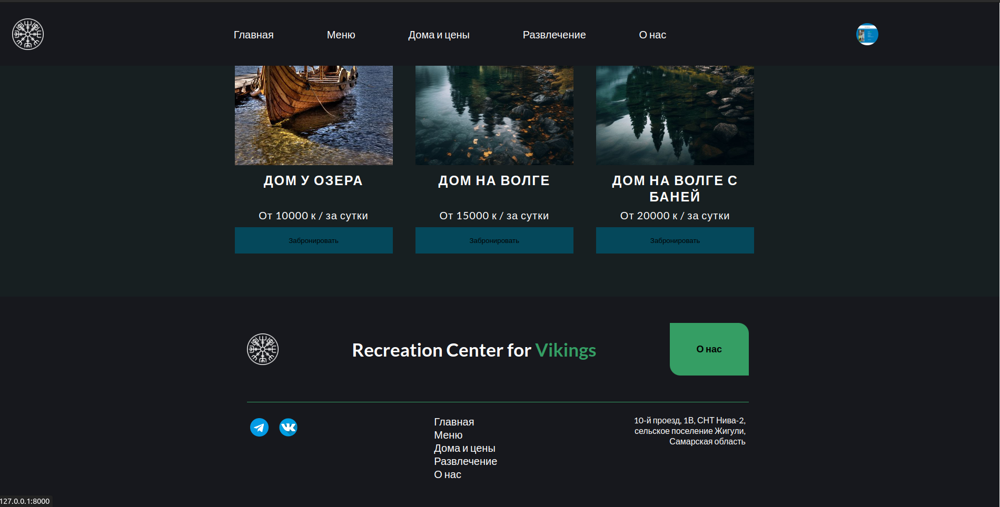
 

   2. Регистрация и Авторизация 
   В Web приложении есть возможность зарегистрироваться и авторизоваться, тем самым 
   у пользователя будут доступны новые возможности.     
   Такие как:   
   Доступ к личному кабинету;  
   Редактирование информации о пользователе;  
   Бронирование услуг;  
   Оставить отзыв на сайте;  

Регистрация пользователя
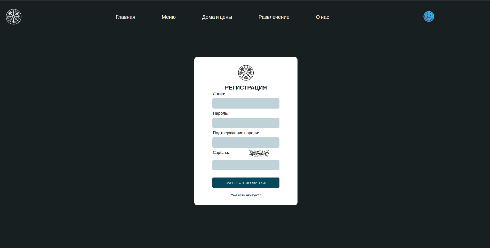
Авторизация пользователя
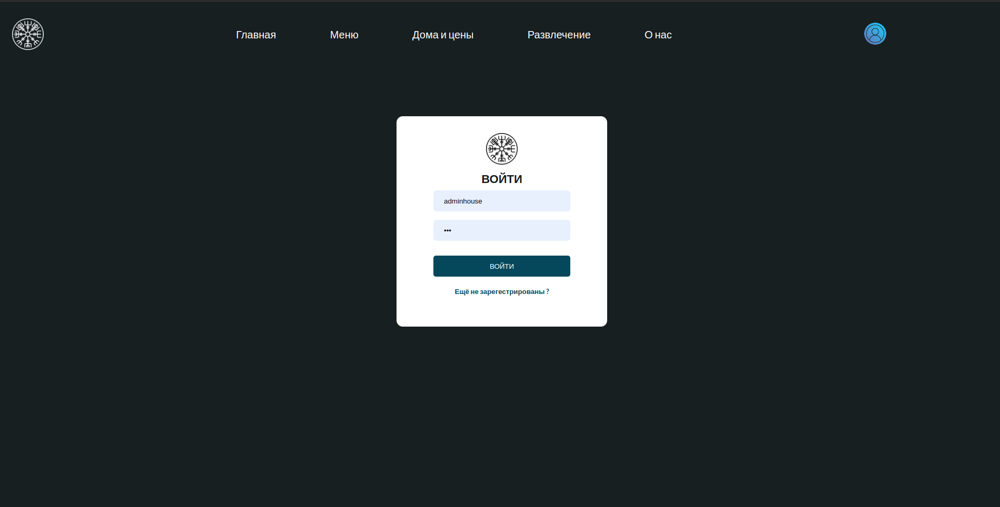
Личный кабинет и его редактирование
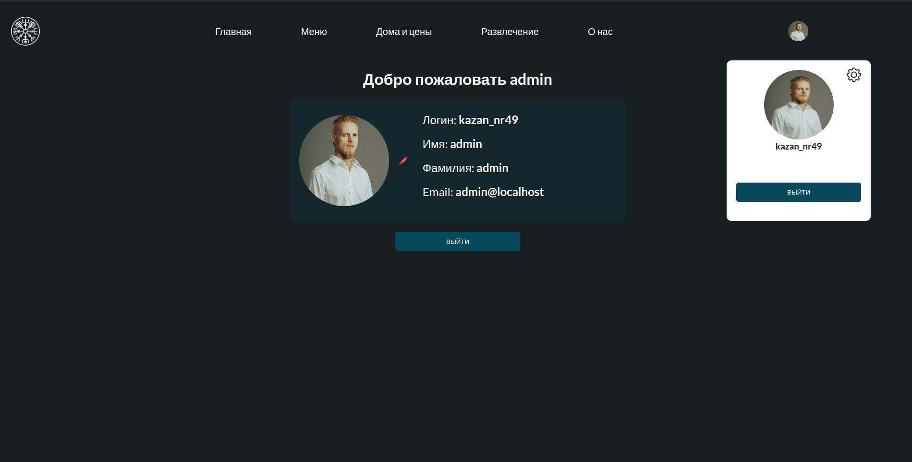
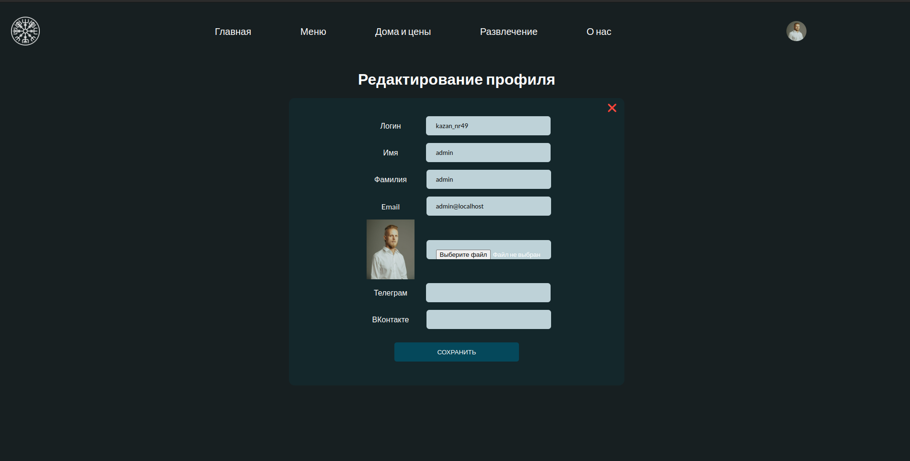

  3. Панель администратора  

   В данном проекте очень понятно и просто реализованна панель администратора, 
   для управлением сайта и добавлением контента. 
   Админ-панель переведена на Русский язык, добавлен поиск, заменены стили
   под регламент текущего проекта.

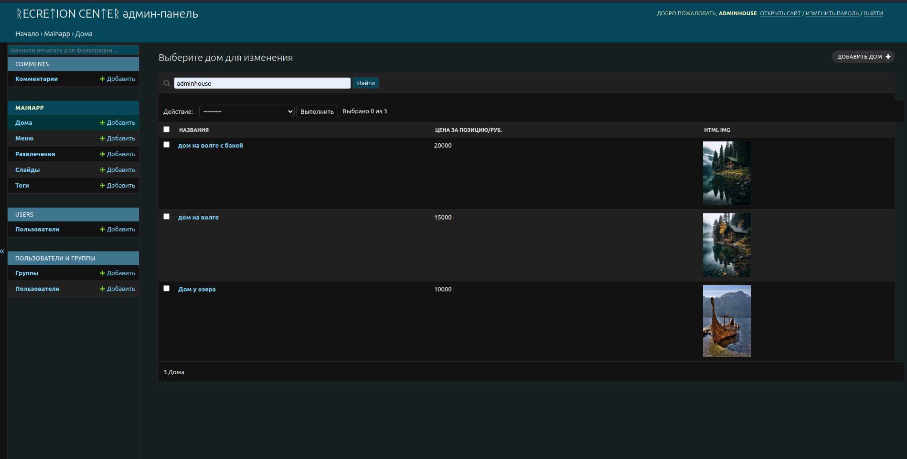

<h3>Для разработки:</h3>

#### 1. Создать виртуальное окружения:
for Linux / Mac:  

      python3 -m venv venv

for Windows:  

      python -m venv venv

#### Активировать:
for Linux / Mac:  

      source venv/bin/activate 
.fish(если используете)

for Windows:  

      venv\Scripts\activate
   

#### 2. Установить зависимости &#128515;:
      pip3 install -r requirements.in
#### Запустить проект локально &#129300;:
      python3 manage.py runserver

#### localhost:
      http://127.0.0.1:8000/

<h3>Admin-panel:</h3>

#### Перейти по адресу:
    http://127.0.0.1:8000/admin

###### Username
    adminhouse
###### Password
    123

##### Для ТГ
      api = 7063888510:AAHBEKEBjlnHFmC2imoI2Oq2hC3KPGqQ_N8
      id = -4134546943

      в сообщения добавить
      Имя: {name} 
      Телефон: {phone}

